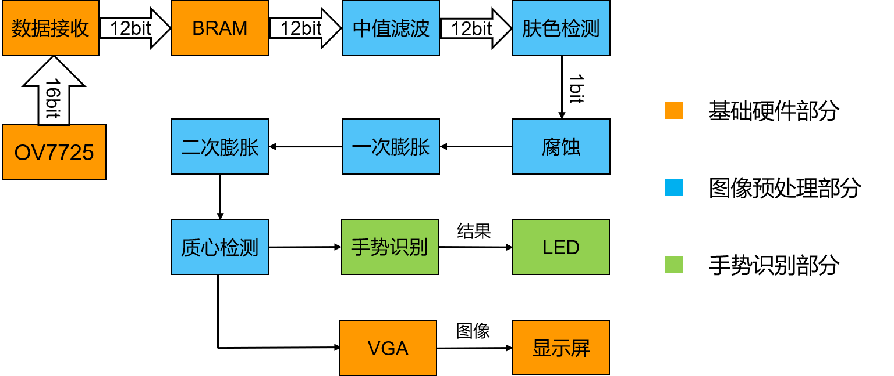
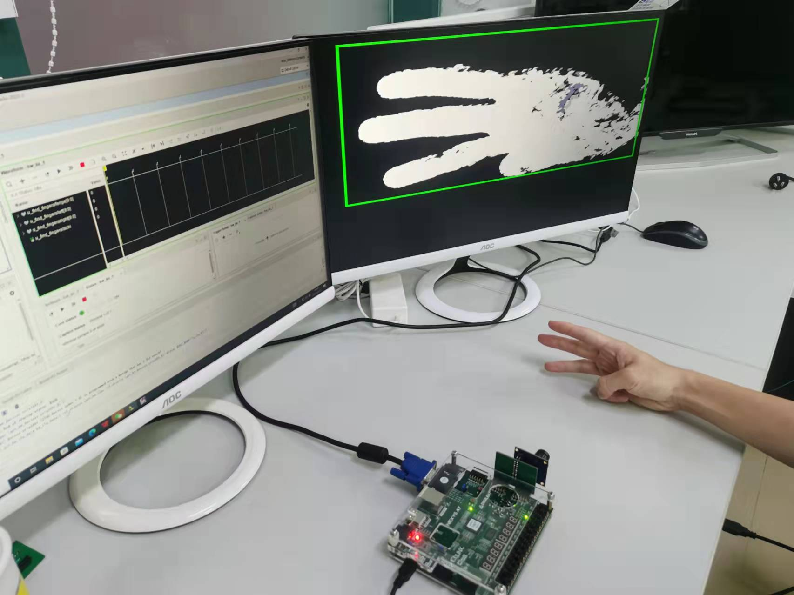
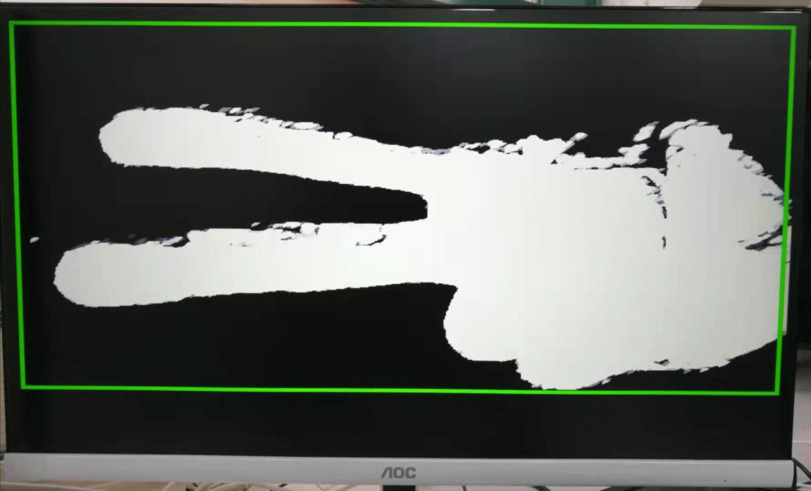
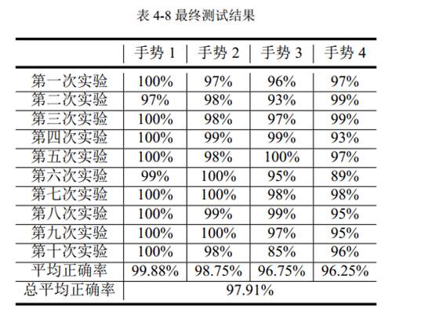

# 手势识别加速器设计

我们设计了一款基于FPGA的静态视觉手势识别加速器，在硬件上实现了对手势1-4的识别。它的优点在于设计简单，实现细节清晰，而且在一定条件下准确率较高，占用资源较少。

## 系统总体框架设计

本系统可以分为三个部分：基础硬件部分、图像预处理部分、手势识别部分。

### 基础硬件部分

在基础硬件部分中，系统首先用摄像头OV7725对手势图像进行采集，其中OV7725需要预先进行寄存器的配置。摄像头采集到的数据经处理后，以RGB444的格式存放在FPGA的片上BRAM中。后续模块从BRAM中读出图像数据，对图像进行预处理等操作。

最后处理后的图像数据，会被传输到VGA显示模块，在显示屏上实时将图像显示出来。

### 图像预处理部分

首先对图像进行中值滤波处理，去除掉图像的部分背景噪声。随后利用YCbCr阈值化，对图像进行肤色提取处理。肤色提取处理后得到的二值图会经过一次腐蚀和两次膨胀的形态学处理。经过这些处理后，图像会被传递给质心检测模块进行手势的分割和加框处理，质心检测模块把手部区域框出来，排除了框外噪点的影响。

### 手势识别部分

手势识别算法借鉴了王然[1]的指尖检测算法，并在其基础上作出了改进，具体步骤如下：

1. 横向扫描，获取手部轮廓点。
2. 寻找横坐标极小值点。
3. 引入约束条件，得到直接识别结果。
4. 统计多帧取手势最大值。

## 硬件及软件平台

- 硬件：
  - 开发板：NEXYS A7
  - 摄像头：OmniVision(豪威) OV7725
- 软件：
  - vivado 2019.2

## 实验结果

系统的实物图以及最终的图像如下图所示：

我们设计了串口程序，通过串口识别最终的结果。当FPGA通过串口传输了100次数据后，就会自动停下来。我们在同一正常背景、充足光照条件下，分别在摄像头前摆放手势1-4，每个手势都会被识别100次。通过这100个数据，统计每种手势的平均准确率。

对于识别速率的测试，我们在系统中引入了timer模块，该模块能够以ms级别计数。

最终得到的测试结果如下表所示(手的距离为20-30cm)：

每次识别的时间为672ms。

## 参考文献

[1]	王然. 实时视觉手势识别系统的 FPGA 硬件设计 [D]. 吉林 : 吉林大学, 2015 年.  